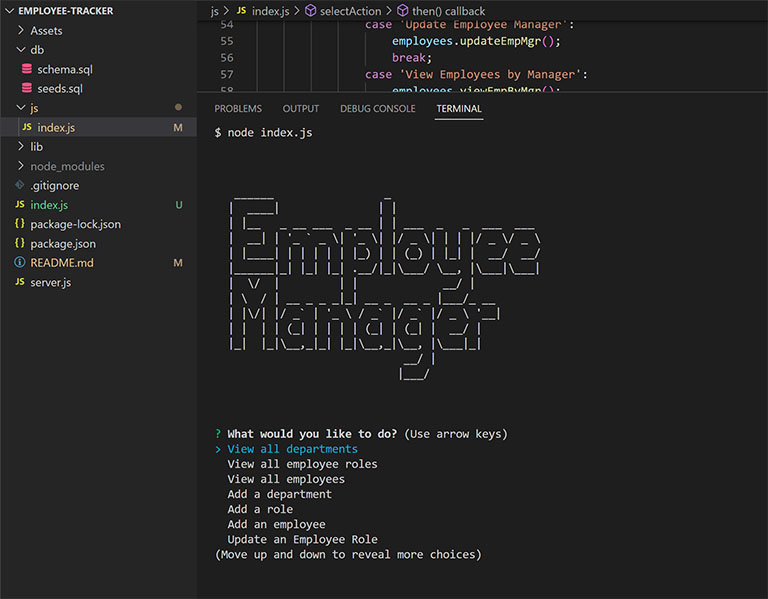
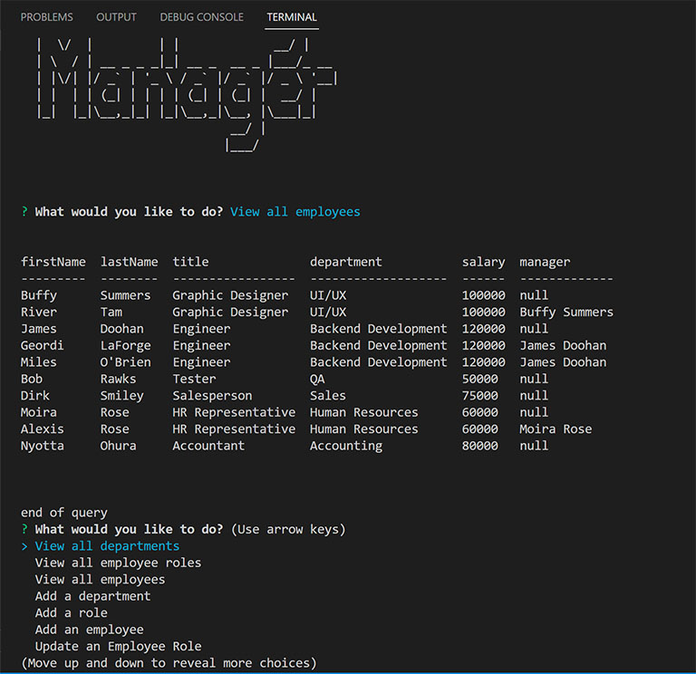

# Employee Tracker CMS Application
A command line application to log the members of a team of employees and pass that data on to an HTML page for use

## The 12th challenge in the UT-Austin Full Stack Development Bootcamp - Create an Employee Tracking application from scratch

___

Our work on backend systems continues with deep dives into databases and SQL. This project is ones that will test our ability to manipulate data in an SQL database using javascript. This is a command-line application so there's no HTML acting as a front end. I used the [Inquirer](https://www.npmjs.com/package/inquirer) npm package to handle the processing of questions and answers as well as [mysql2](https://www.npmjs.com/package/mysql2) to directly manipulate the database with javascript.

Because this isn't a deployed app, there's not a link to a live site showing it's functionality. Instead, you can watch a video here that shows how it works.

[Video of the Development Team Generator in Action](https://drive.google.com/file/d/1lSUTUFGxwM-rN99UC_Orp-QTecgInhgt/view)

___

## How to use

From the parent folder of the index.js file, call on index.js. You'll start off with a prompt asking you what actions you're like to take.

You have many choices here:
    - View all departments
    - View all roles 
    - View all employees
    - Add a department
    - Add a role
    - Add an employee
    - Update an employee's role
    - Update an employee's Manager
    - View employees by Manager
    - View employees by Department
    - Delete Department
    - Delete roles
    - Delete employees

Each response may have additional information, but you can easily follow along with the prompts. Your backend database will be updated with all the new information as you go along.

___

## Changes Made and Lessons Learned

- I learned a lot about how important overall structure is when creating an application. Based on the plan for the program, I found myself constantly battling against circular assignments. Eventually I stumbled on the solution of requiring the index.js within the scope of each individual function instead of the entire page. Now that we're progressing to use async/await functionality I'm hopeful that I won't have nearly as many of the problems when it comes to timing of functions and calls to pages.

- Creating accurate SQL queries turned in to an entirely new process. I would spend almost as much time figuring out the syntax for a query I needed as I would spend figuring out the function itself. In some cases I spent way more time on the query. In the future I will definitely use [sequelize](https://www.npmjs.com/package/sequelize) to streamline work in SQL.

- Once I was finished I realized that I wanted the end-user to be able to to launch the app from the root directory instead of the js folder where I built index.js. I like the idea of keeping everything modular so instead of moving that file and relinking all my functions across all my .js files, I created an index.js in the root with a splash screen that would immediately launch the code in the original index. 

- I would definitely prefer to have my passwords as environment variables.

- Add an option to end the program.

___

## Possible Future Changes

- While everything works as intended, I would like to go back at some point and see if I can simplify some of the functions and maybe use some loops that would be better or more efficient.

___

## Credits
Thanks to Leah, Ian, Diem, Negin, and all the other students who keep teaching and talking us through all the twists and turns of coding.

___

## License

MIT License

Copyright (c) 2022 Mark Gardner

Permission is hereby granted, free of charge, to any person obtaining a copy
of this software and associated documentation files (the "Software"), to deal
in the Software without restriction, including without limitation the rights
to use, copy, modify, merge, publish, distribute, sublicense, and/or sell
copies of the Software, and to permit persons to whom the Software is
furnished to do so, subject to the following conditions:

The above copyright notice and this permission notice shall be included in all
copies or substantial portions of the Software.

THE SOFTWARE IS PROVIDED "AS IS", WITHOUT WARRANTY OF ANY KIND, EXPRESS OR
IMPLIED, INCLUDING BUT NOT LIMITED TO THE WARRANTIES OF MERCHANTABILITY,
FITNESS FOR A PARTICULAR PURPOSE AND NONINFRINGEMENT. IN NO EVENT SHALL THE
AUTHORS OR COPYRIGHT HOLDERS BE LIABLE FOR ANY CLAIM, DAMAGES OR OTHER
LIABILITY, WHETHER IN AN ACTION OF CONTRACT, TORT OR OTHERWISE, ARISING FROM,
OUT OF OR IN CONNECTION WITH THE SOFTWARE OR THE USE OR OTHER DEALINGS IN THE
SOFTWARE.